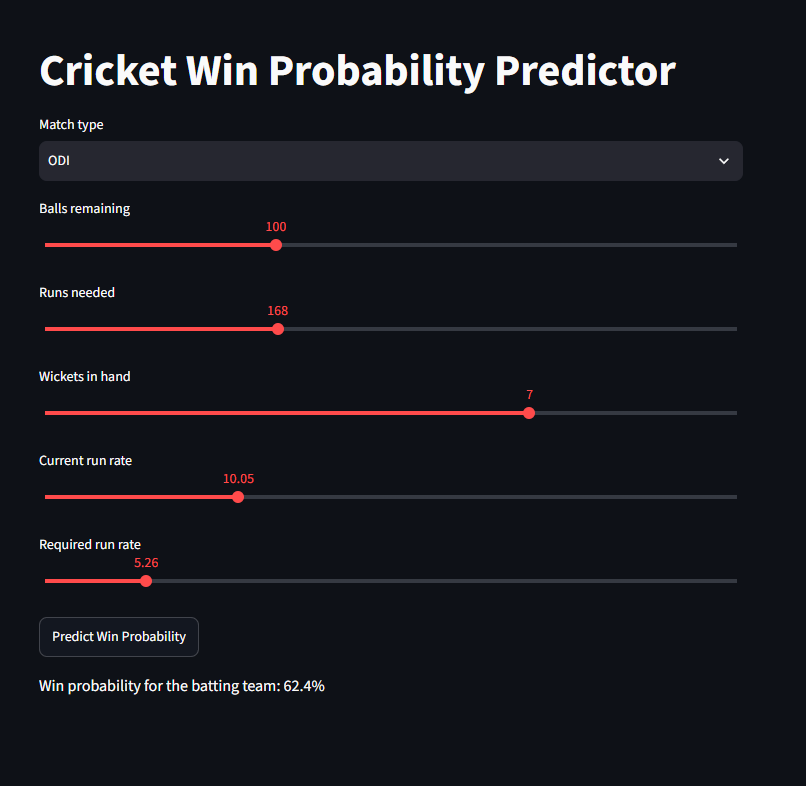
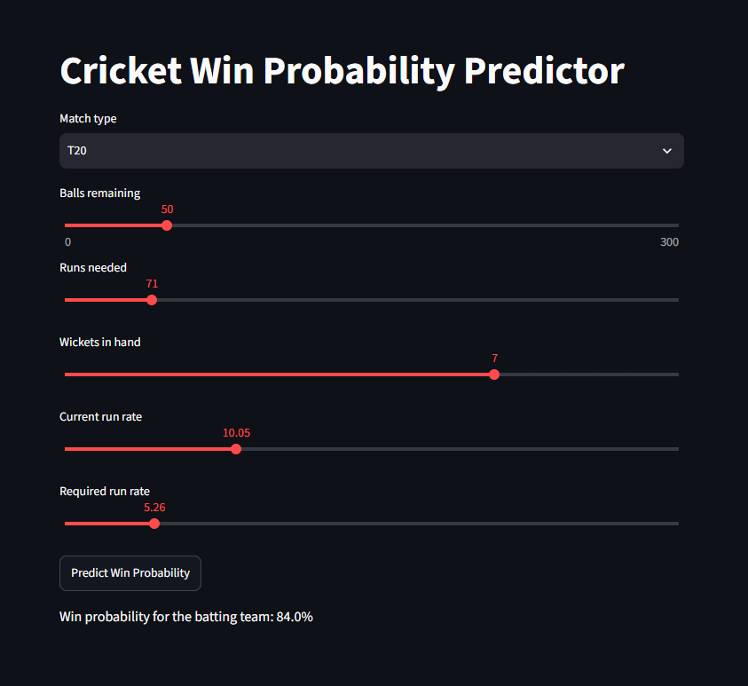

# Cricket Win Probability Predictor
A machine learning web app that predicts a team's live win probability during the second innings of a limited-overs cricket match.

## Overview
This project uses ball-by-ball data from T20 and ODI cricket internationals, sourced from Cricsheet — approximately 958,000 rows across roughly 5,720 matches — to train a machine learning model that predicts a team's win probability at any point during a run chase. The model takes five features as input — balls remaining, runs needed, wickets in hand, current run rate, and required run rate — and outputs the batting team's probability of winning at that exact moment in the match.

## Features
- [x] Data pipeline that parses raw Cricsheet ball-by-ball CSVs into a clean, model-ready dataset
- [x] Correct handling of illegal deliveries (wides/no-balls) when counting legal balls bowled
- [x] Match-level train/test split to prevent data leakage between correlated balls in the same match
- [x] Logistic regression baseline model
- [x] Random forest model, tuned via `GroupKFold` cross-validation to prevent overfitting
- [x] Interactive Streamlit app with live win probability predictions
- [x] Pytest test suite covering core feature-engineering logic, using hand-verified fixture data
- [ ] Support for women's international matches (currently men's ODI/T20I only)
- [ ] Team-identity features (batting/bowling team) — currently excluded for simplicity

## Methodology
The dataset was split into training and test sets at the **match level**, not the ball level. Balls within the same match are highly correlated and share the same outcome, so a random split at the ball level would let the model see balls from a match it was also being tested on — artificially inflating test accuracy and giving a misleading picture of how well the model generalizes to genuinely new matches.

I started with a logistic regression baseline, which achieved 82% test accuracy. I then tried a random forest with default settings, which performed worse (79% test accuracy) despite fitting the training data almost perfectly (98.5% train accuracy) — a clear sign of overfitting, where the model had memorized noise specific to the training matches rather than learning generalizable patterns.

To fix this, I constrained the random forest using `max_depth` and `min_samples_leaf`, and used `GroupKFold` cross-validation (grouped by match, for the same leakage reasons as the train/test split) to properly compare a few depth values rather than relying on a single split. A max depth of 10 gave the best average cross-validation accuracy (82.3%), closely matching — and very slightly exceeding — the logistic regression baseline.

The final model is a random forest (`max_depth=10, min_samples_leaf=50`), achieving 83% accuracy on the held-out test set, with balanced precision and recall across both outcomes.

## Tech stack
- Python
- pandas (data processing and feature engineering)
- scikit-learn (logistic regression, random forest, cross-validation)
- Streamlit (interactive web interface)
- joblib (model persistence)
- pytest (testing)
- Data source: [Cricsheet](https://cricsheet.org/) ball-by-ball match data

## Demo



## Installation
```bash
git clone https://github.com/Karthik-natarajan06/cricket-win-predictor.git
cd cricket-win-predictor
python -m venv .venv
source .venv/Scripts/activate  # or .venv/bin/activate on Mac/Linux
pip install -r requirements.txt
```

To rebuild the dataset and retrain the model from scratch (requires downloading raw match data from [Cricsheet](https://cricsheet.org/downloads/) into `data/raw/odis/` and `data/raw/t20s/`):
```bash
python src/build_dataset.py
python src/train_model.py
```

To run the app:
```bash
streamlit run app/streamlit_app.py
```
Then open `http://localhost:8501` in your browser.

## What I'd improve with more time
- Add team-identity as a feature — some teams likely chase differently under pressure
- Extend to women's international matches
- Try gradient boosting models (e.g. XGBoost) for comparison against the random forest
- Add a live match state chart showing how win probability evolves ball-by-ball across a real match
- Add a CI pipeline running the test suite on every push

## License
MIT
